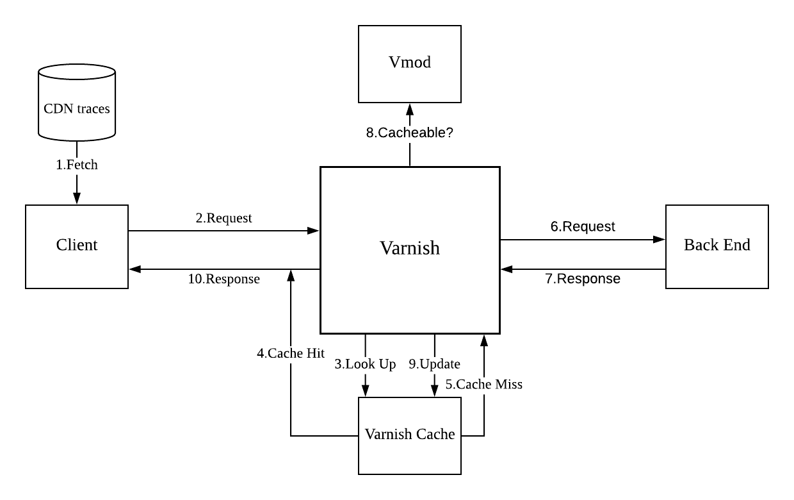
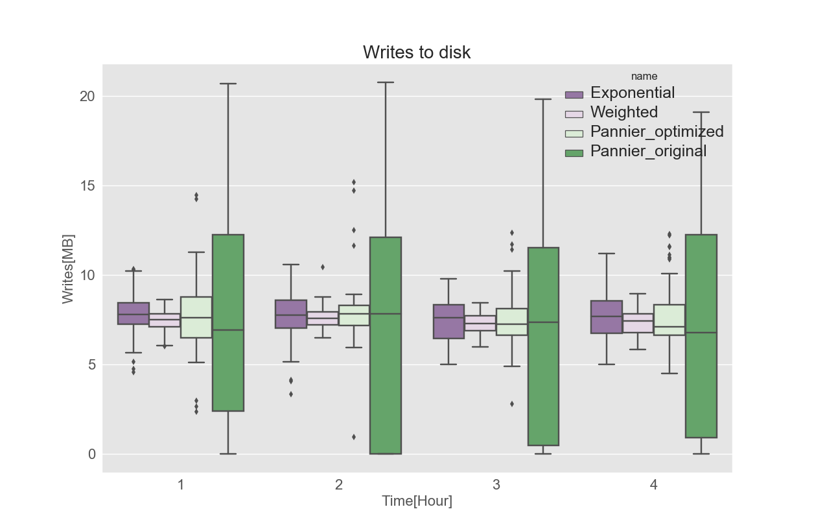
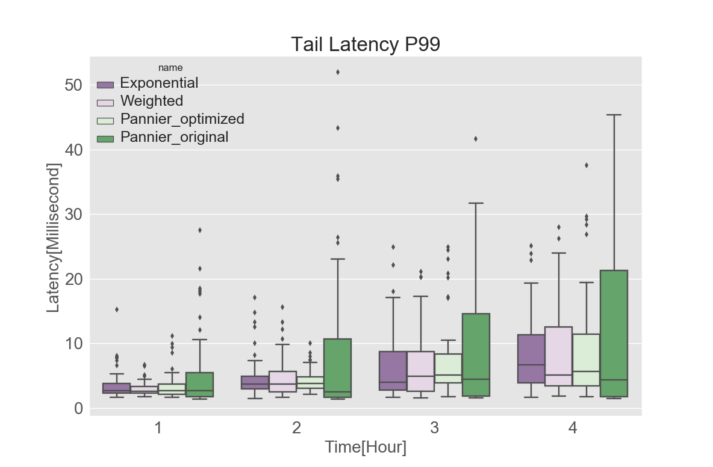
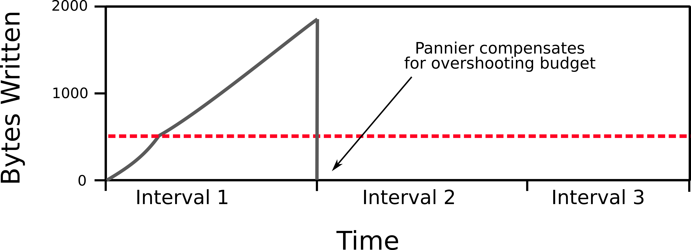
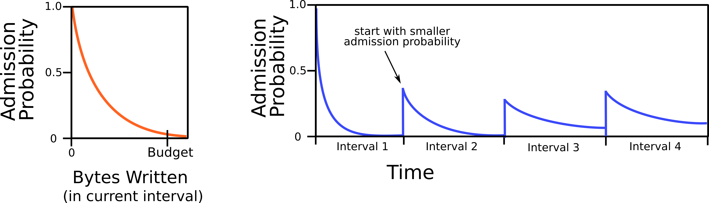

# Budgetier: Extending the lifespan of CDN SSD caches
In this CMU research project, we are optimizing the Varnish caching system for flash drives and CDN request traffic.

CDN want to use flash drives (or SSDs) because they have much faster read/write speeds than spinning disks. As the price of flash drives decreases over the years, it is reasonable to replace the spinning disks used in CDN with flash drives.

The key problem in using flash in CDN servers is that flash drives have a limited write budget before their performance severely degrades. For example, a Samsung SSD (960 EVO NVMe M.2 250GB), which we use in our experiments, is built for about 150TB of writes (Samsung's guarantee).

This research explores
* new control policies that limit object admission to CDN cache to achieve a write budget (such as 150TB over 3 years)
* while maintaining high hit ratios
* and while handling the high throughput requirements of CDNs.

## Experiment explained
Our experiment uses [Varnish Cache](https://github.com/varnishcache/varnish-cache) to simulate the CDN. Varnish is a caching system used by many CDNs in production. In our experiment varnish sits between the client and a backend server (origin). When a request comes to Varnish, Varnish will look up the requested object in its cache and respond to clients if the object is found. If the object is not found in its cache, Varnish will fetch it from the origin and cache it before sending back to clients. 

We implemented our own client in Golang. Our backend server is using [origin](https://github.com/dasebe/webtracereplay) combined with Nginx.

### Workflow


The workflow is showed as above. This is only an illustrative diagram of how our experiment works, the specific internal workflow of varnish is linked [here](https://book.varnish-software.com/4.0/chapters/VCL_Basics.html).

The basic idea is when a cache miss happens, varnish will fetch the object from backend and call our customized Vmod to decide whether to cache that object. So the Vmod is where we implement our admission policy. 

In order for Varnish to call our Vmod, we also need to specify a VCL file. VCL stands for Varnish Configuration Language, we use it to control Varnish workflow. VCL file is loaded into Varnish when Varnish starts, but it can also be loaded even when Varnish is running.


### Current results
We warm up the cache and replay a CDN production trace for 4 hours.

Without using control policy, Varnish will crash due to disk I/O blocking. 

From figure above we can see that the original Pannier has higher hit ratio compared to our approaches. But the difference is not significant.

The graph above shows that the original Pannier has greater variance in terms of writes to the disk.

As a result of greater variance, the original Pannier has higher latency as showed in the graph above.


### Control policy 
#### Pannier
The way that [Pannier](https://dl.acm.org/citation.cfm?id=3094785) does is maintaining a ghost cache besides the Varnish Cache(real cache). The ghost cache is used to track objects by recording their metadata. When requests miss in Varnish cache, their records in ghost cache will be updated. When missing times of objects exceeds a threshold, then they will be admitted.

The way to tune the threshold is to calculate a quota for a time interval. The quota is the amount of writes allowed during a period of time, and the way to calculate, for example, is to divide 150TB by 3 years. During a time interval, if the amount of writes is below the quota, we admit everything. When amount of writes is over that quota, we begin to control admission by increasing threshold. And the penalty for exceeding quota is to not admit anything in the next few time intervals until the average of writes comes below the quota again. The graph below illustrate this idea.



The problems of this approach are
* hard to implement in production environment
* and high latency

#### Our Approach
The way we do is to use a probabilistic model. Instead of maintaining a ghost cache, we assign a probability of admission to each coming request. The reason is simple, given a probability such as 1%, if an object has been requested 100 times, then on average it will have high chance of being admitted. Using this approach we achieve the same goal with very few lines of code. The graph below shows our idea.



### Current Research
Currently, we are experiment with many different admission probability models, e.g. linear, exponential, log.


## Repeat our experiments

### Prerequisites
We use Ubuntu 17.10, so the following guide is based on that.

To build varnish from scratch, we first need to install [dependencies](https://varnish-cache.org/docs/trunk/installation/install.html)

For Ubuntu that we use, install the following

```
sudo apt-get install \
    make \
    automake \
    autotools-dev \
    libedit-dev \
    libjemalloc-dev \
    libncurses-dev \
    libpcre3-dev \
    libtool \
    pkg-config \
    python-docutils \
    python-sphinx
```
Also you need to install Golang since our client is written in Go
```
sudo apt-get install golang-go
```
### Get Varnish source code

We use latest Varnish version 6.0 from github.

```
git clone https://github.com/varnishcache/varnish-cache.git
```
And checkout to 6.0 branch

### Install Varnish

Just like install any other software

```
cd varnish-cache
./configure --prefix=/usr/local/varnish/
make 
make install
```

### Install Vmod
Vmod is the place that we can implement our own policy, to install it, you can
```
cd vmod-disk
export PKG_CONFIG_PATH=/usr/local/varnish/lib/pkgconfig
./autogen.sh --prefix=/usr/local/varnish
./configure --prefix=/usr/local/varnish/
make
make install
```

### How to call vmod
We can use vcl to control varnish and to call our vmod, a sample vcl file that we use looks like this
```
vcl 4.0;

import static;
import std;

backend default {
    .host = "127.0.0.1";
    .port = "7000";
}
sub vcl_backend_response {
  if (!static.lru(bereq.url,beresp.http.Content-Length,true,0.25)) {
      set beresp.uncacheable = true;
      set beresp.ttl = 0s;
      return (deliver);
  } else {
	set beresp.uncacheable = false;
	set beresp.ttl = 2419000s;
	return(deliver);
  }
}

```
The code above means if a cache miss happens, varnish will go to fetch data from backend, and after response returns, it will call vcl_backend_response. Then we call our static vmod to apply our policy.

For detailed information how to write vcl you can go [here](https://varnish-cache.org/docs/trunk/users-guide/vcl.html)

## Setting up experiment

### Start Back end
According to [link](https://github.com/dasebe/webtracereplay)
```
sudo nginx -c server/nginx.conf
spawn-fcgi -a 127.0.0.1 -p 9000 -n origin/origin origin/origin.tr
```
Here we name the trace origin.tr, which is not included in this repo. 
### Start Varnish
In our case
```
sudo /usr/local/varnish/sbin/varnishd -a 0.0.0.0:6081 -n /your/dir/of/vsm -f /your/dir/of/vcl_file -T localhost:6082 -s Memory=file,/your/dir/of/nvme/cache.dat,200g -s Transient=malloc,5G
```
### Start monitor tools

#### Disk utilization
We use sar to moniotr disk utilization, update every 5 seconds
```
sar -d -p 5
```

#### Disk write
We use S.M.A.R.T to monitor disk write
```
sudo nvme smart-log /dev/nvme0
```
to only get disk write, disk read and temperature, use
```
sudo nvme smart-log /dev/nvme0 | egrep 'data_units_written|data_units_read|temperature'
```
Remember to install a fan on your NVMe ssd. The temperature will rise up to 80 degree Celsius when doing experiment and that will cause damage to your disk.

#### Request throughput and hitratio
We use varnishstat to get client request and cache hit data
```
sudo /usr/local/varnish/bin/varnishstat -n /your/dir/of/vsm -f MAIN.client_req -f MAIN.cache_hit
```
The vsm directory is where varnishstat will read shared log. To output into a file we can use flag -j, it will output in json format and it is easy to parse when plotting.

### Start client
Start client to send request by using flag -clientTrace
```
cd ./client
go build client.go
./client -clientTrace client.tr
```
In our case the CDN trace is located in the same directory with client, and traces are not included in this repo. 

Now we should be able to do the experiment.

## Author
* [Daniel S. Berger](https://github.com/dasebe)
* Wenqi Mou
