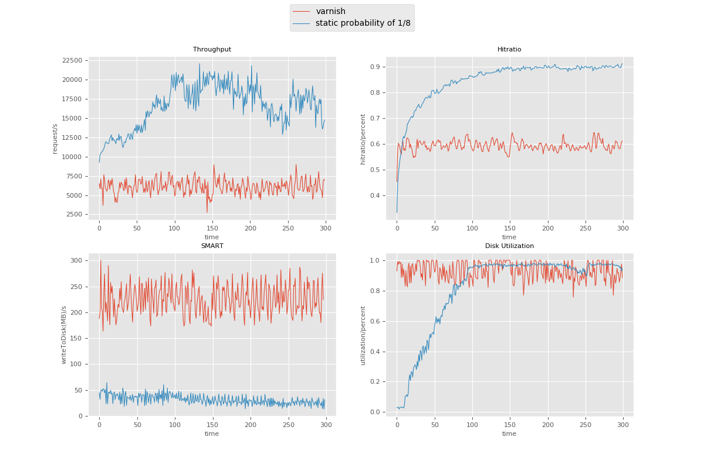
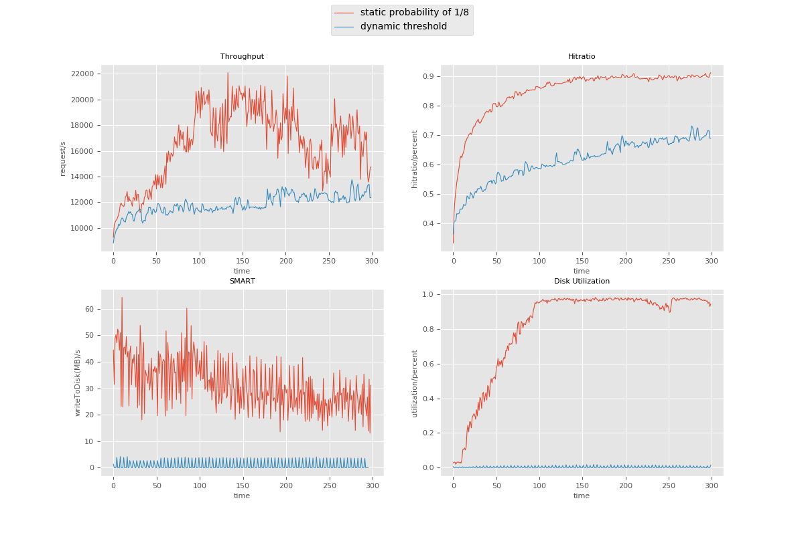

# Budgetier: Extending the lifespan of CDN SSD caches
In this CMU research project, we are optimizing the Varnish caching system for flash drives and CDN request traffic.

The reason why we want to use flash drives is that flash drives, or SSDs, are much faster than spinning disks both in read and write. As the price of flash drives decreases over the years, it is reasonable to replace the spinning disks that used in CDN with flash drives.

But the key problem in using flash in CDN is that flash has significant aging issues, you could only write to the flash a certain number of times before you lose that section of the drive, and performance would generally get worse over time as well. For a samsung SSD(960 EVO NVMe M.2 250GB) that we use for experiment, it has only 150TB writes budget according to Smartmontools, which means the SSD does not guarantee to perform properly if writes are beyond that budget.

So the goal of this research is
* to find a good control policy that can limit the object admission to disk cache
* to maintain high hit ratios 
* to be able to handle real request pattern in CDN


## Experiment explianed
Our experiment uses [Varnish Cache](https://github.com/varnishcache/varnish-cache) to simulate the CDN. Varnish is a reverse proxy sitting in between web backend servers and clients. When a request comes to Varnish, Varnish will first search for the requested object its cache and respond to clients if the object is found. If the object is not found in its cache, Varnish will fetch it from the backend and cache it before sending back to clients. 

We implemented our own client in Golang. Our backend server is using [origin](https://github.com/dasebe/webtracereplay) combined with Nginx.

### Workflow


The workflow is showed as above. This is only an illustrative diagram of how our experiment works, the specific internal workflow of varnish is linked [here](https://book.varnish-software.com/4.0/chapters/VCL_Basics.html).

The basic idea is when a cache miss happens, varnish will fetch the object from backend and call our customized Vmod to decide whether to cache that object. So the Vmod is where we implement our admission policy. 

In order for Varnish to call our Vmod, we also need to specify a VCL file. VCL stands for Varnish Configuration Language, we use it to control Varnish workflow. VCL file is loaded into Varnish when Varnish starts, but it can also be loaded even when Varnish is running by calling Varnishadm. 

### Control policy 
To control obejct admission, the intuitive way is not to admit those object that only appear few times. One way to do that is maintaining a ghost cache beside the Varnish Cache(real cache). The ghost cache is a least recent use cache that keeps track of many objects(2x size of real cache) by recording their metadata and keeping counters. When a request comes in and has cache miss, varnish will call our vmod and put the metadata of that object into ghost cache and set the counter of that object to be one. Next time if the same object comes, its counter will increase. We keep a threshold that only object with a greater counter value can be admitted into real cache. Clearly by doing this we can admit objects that potentially lead to high hit ratio.

The way to tune the threshold is similar to [Pannier](https://dl.acm.org/citation.cfm?id=3094785). We calculate a quota for a time interval. The quota is the amount of writes that allowed during a period of time, and the way to calculate, for example, is to divide 150TB by 3 years. Below that quota in a given time interval, we admit everyhing. When amount of writes is over that quota, we begin to control admission by increasing threshold. And the penalty for excreeding quota is to not admit anything in next few time interval until the average of writes comes below the quota again. The detailed explanition is in that paper.

Another way to control admission is to use a probability model. Instead of setting threshold and maintaing ghost cache, we tune a probability of admission using the same idea mentioned above. A simple explaination of this model is when an object has been requested a lot, it has high chance of being admitted, and for those object requested few times, they might not get admitted. We tune the probability to achieve the same goal as before with very few lines of code.

### Current results
We are using a production trace and set it to run for 300 minutes.

The result below shows a comparision between just using Varnish and using a static probability model. 1/8 means for every object it has 1/8 probability to be admitted.

From figure we can see useing a probability model can increase the hitratio by almost 30% compared to plain Varnish and it also reduces the writes to disk. The problem is that it does not control the writes as we want.

The graph above shows static probability and dynamic threshold, we can see dynamically tuning can really control the writes to disk as we want, but the hitratio increases very slow.


### Further experiment
Next we want to try different model of probability e.g. expontial, log. Tune the dynamic threshold to increase the hitratio and relax control a bit to increase disk utilization. Add more metrics and try different traces or longer traces. Also control the client sending rate to simulate the real production environment.
## Let's do experiment


### Prerequisites
We use ubuntu 17.10, so the following guide is based on that.

To build varnish from scratch, we first need to install [dependencies](https://varnish-cache.org/docs/trunk/installation/install.html)

For ubuntu that we use, install the following

```
sudo apt-get install \
    make \
    automake \
    autotools-dev \
    libedit-dev \
    libjemalloc-dev \
    libncurses-dev \
    libpcre3-dev \
    libtool \
    pkg-config \
    python-docutils \
    python-sphinx
```
Also need to install Golang since our client is written in Go
```
sudo apt-get install golang-go
```
### Get Varnish source code

We use latest Varnish version 6.0 from github.

```
git clone https://github.com/varnishcache/varnish-cache.git
```
And checkout to 6.0 branch

### Install Varnish

Just like install any other software

```
cd varnish-cache
./configure --prefix=/usr/local/varnish/
make 
make install
```

### Install Vmod
Vmod is the place that we can implement our own policy, to install it, you can
```
cd vmod-disk
export PKG_CONFIG_PATH=/usr/local/varnish/lib/pkgconfig
./autogen.sh --prefix=/usr/local/varnish
./configure --prefix=/usr/local/varnish/
make
make install
```

### How to call vmod
We can use vcl to control varnish and to call our vmod, a sample vcl file that we use looks like this
```
vcl 4.0;

import static;
import std;

backend default {
    .host = "127.0.0.1";
    .port = "7000";
}
sub vcl_backend_response {
  if (!static.lru(bereq.url,beresp.http.Content-Length,true,0.25)) {
      set beresp.uncacheable = true;
      set beresp.ttl = 0s;
      return (deliver);
  } else {
	set beresp.uncacheable = false;
	set beresp.ttl = 2419000s;
	return(deliver);
  }
}

```
The code above means if a cache miss happen, varnish will go to fetch data from backend, and after response returns, it will call vcl_backend_response. Then we call our static vmod to apply our policy.

For detailed information how to write vcl you can go [here](https://varnish-cache.org/docs/trunk/users-guide/vcl.html)

## Setting up experiment

### Start Back end
According to [link](https://github.com/dasebe/webtracereplay)
```
sudo nginx -c server/nginx.conf
spawn-fcgi -a 127.0.0.1 -p 9000 -n origin/origin origin/origin.tr
```
Here we name the trace origin.tr, which not included in this repo. 
### Start Varnish
In our case
```
sudo /usr/local/varnish/sbin/varnishd -a 0.0.0.0:6081 -n /your/dir/of/vsm -f /your/dir/of/vcl_file -T localhost:6082 -s Memory=file,/your/dir/of/nvme/cache.dat,200g -s Transient=malloc,5G
```
### Start monitor tools

#### Disk utilization
We use sar to moniotr disk utilization, update every 5 seconds
```
sar -d -p 5
```

#### Disk write
We use S.M.A.R.T to monitor disk write
```
sudo nvme smart-log /dev/nvme0
```
to only get disk write, disk read and temperature, use
```
sudo nvme smart-log /dev/nvme0 | egrep 'data_units_written|data_units_read|temperature'
```
Remember to install a fan on your NVMe ssd. The temperature will rise up to 80 degree Celsius when doing experiment and that will cause damage to your disk.

#### Request throughput and hitratio
We use varnishstat to get client request and cache hit data
```
sudo /usr/local/varnish/bin/varnishstat -n /your/dir/of/vsm -f MAIN.client_req -f MAIN.cache_hit
```
The vsm directory is where varnishstat will read shared log. To output into a file we can use flag -j, it will output in json format and it is easy to parse when plotting.

### Start client
Start client to send request by using flag -clientTrace
```
cd ./client
go build client.go
./client -clientTrace client.tr
```
In our case the CDN trace is located in the same directory with client, and traces are not included in this repo. 

Now we should be able to do the experiment.

### Plot
The pyfile has the plotting code that we use, basically there are two modes.

#### Plot in real time
Suppose you are running this experiment on a server(our case), to monitor the data in real time we can use ssh file share to mount a remote dir locally.
```
sudo sshfs -o allow_other,defer_permissions -p [your port] [your server ip]:[your data directory on server] [your local directory]
```
Put the pyfile into that local directory and change the file name in code if nescessary, call
```
python plot.py
```
#### Plot all data
Plot all with a flag -a, adjust time interval using flag -m, specify file name using -f 
```
python plot.py -a -m 1 -f nvme4,nvme8,nvme16
```
The example above plot all data in those three file in a time interval of one minute.

## Author
* Wenqi Mou

## Acknowledgments

* Handsome advisor [Daniel S. Berger](https://github.com/dasebe)
